## Introduction to Arduino

### Types of Arduino

Just like Raspberry Pi, Arduino is both the name of a computer company and their product: a single-board  micro-controller for building digital devices and interactive objects that can sense and control objects in the physical and digital world. The project's products are distributed as open-source hardware and software, which are licensed to allow anyone to manufacture Arduino boards.

There are lots of different types of Arduino. Many are based around the ATMega328 chip, although there are now lots of other varieties in use.

Official Arduino/Genuino models come in a range of sizes. from left to right: Leonardo, Uno, MKR Zero and Micro.

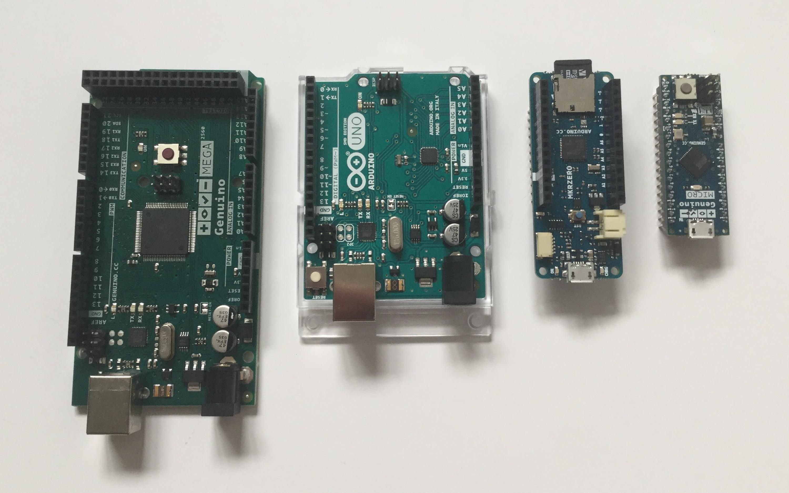

The most common Arduino model, and one often used for prototyping is the Uno. There have been several different versions of the Uno, the latest being Rev. 3 (right below). You can see that the older versions have a much larger Intergrated Circuit (chip) - this is the ATMega328.

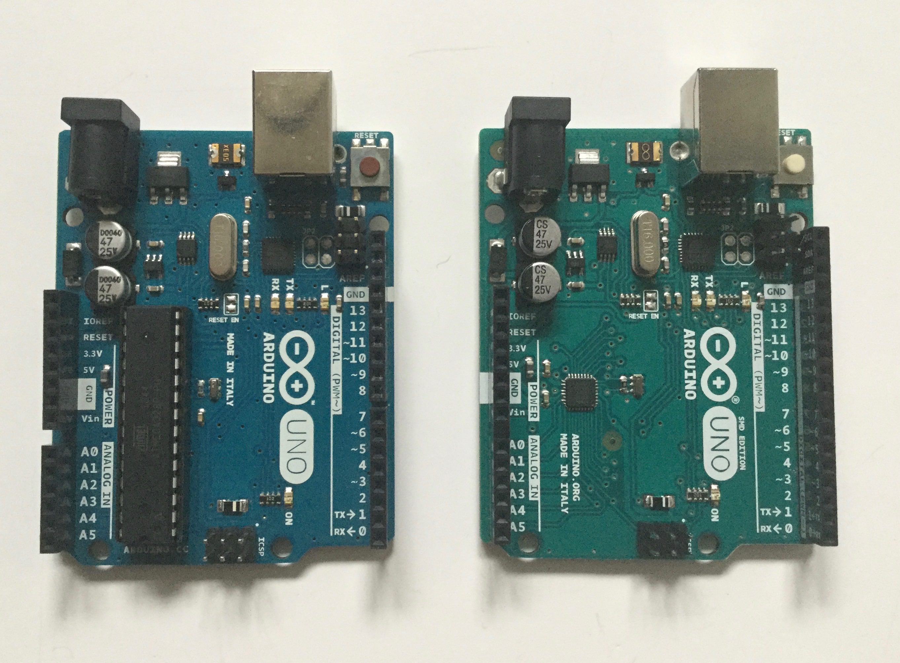

The Rev .3 also has the ports labels on the side to make wiring up circuits even easier.

In this project we'll be using an Uno in the circuit diagrams, however you can use one of the smaller Arduinos like the Micro in exactly the same way. You just need to ensure that you look up the pinouts for whichever model you're using (to make sure you're connecting things to the right pins) and select the right board when uploading code from the editor.

Arduino is Open-source hardware and shares much of the principles and approach of free and open-source software. In particular, they believe that people should be able to study their hardware to understand how it works, make changes to it, and share those changes. Therefore many other companies release Arduino-compatible products. For example, Adafruit make some very small Trinket models. These also use much less power and are therefore great for projects that are powered by batteries.

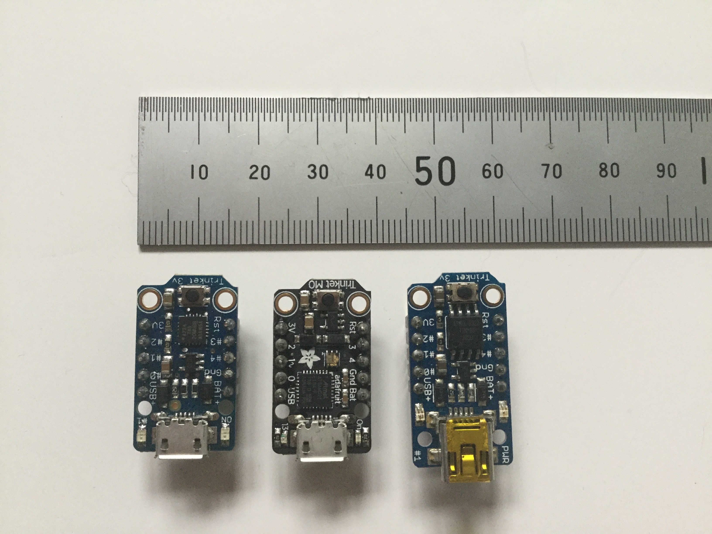

Once again, these can be programmed in the same way as the larger models, and code written for an Uno can be compiled to run on a Trinket (although some features such as the Serial Monitor which we'll be using in this project) are not supported. So developers will often test and prototype their project on an Uno, using the Serial monitor for debugging, then once they've got everything working, transfer their code to a Trinket.

Just like the Raspberry Pi has HATs, you can also purchase add-on boards for Arduino, called Shields.

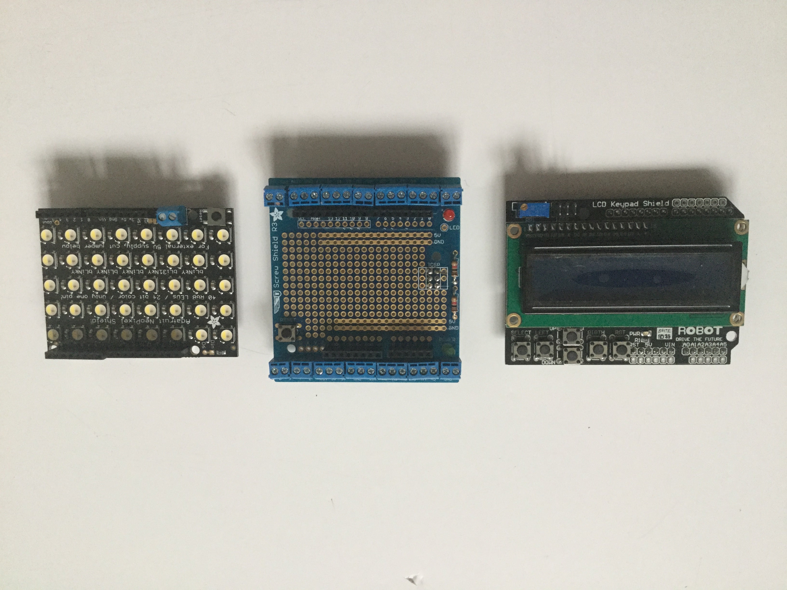

These have pins that match up with the ports on an the Arduino - most are designed for the Uno but there are also shields for the Leonardo too.

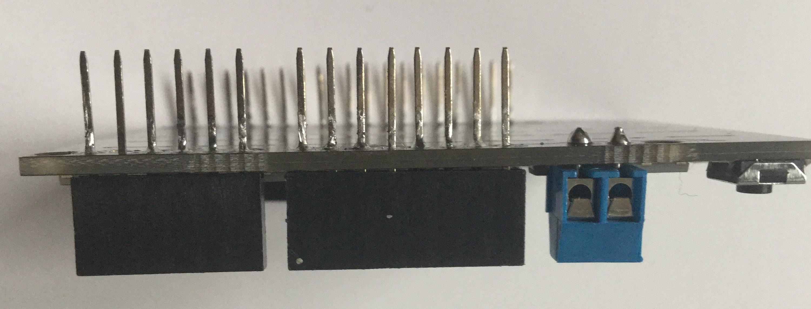

The DIY Gamer Kit is an advanced Shield turns an Arduino Uno into a programmable handheld Games Console.

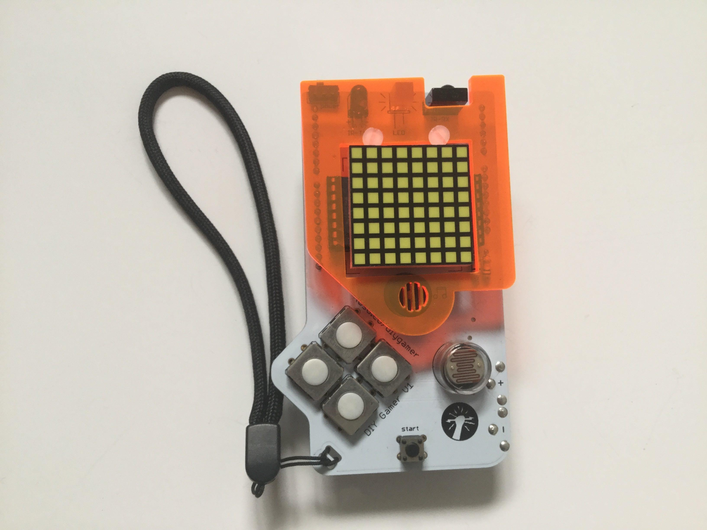

Adafruit also make a range of smaller boards called Feather, which often have built-in addaitional hardware and also come with their own range of add-ons (called Wings).

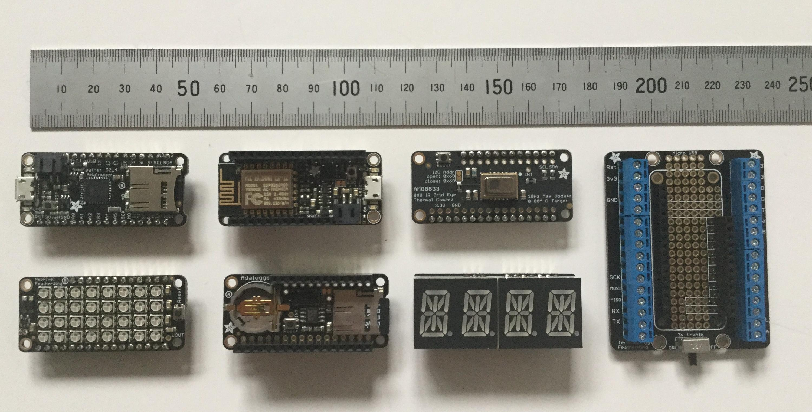

The last couple of years has seen some new innovative ways or making Arduino compatible boards designed especially for prototyping. The MonkMakesDuino is one that can be plugged directly into a breadboard:

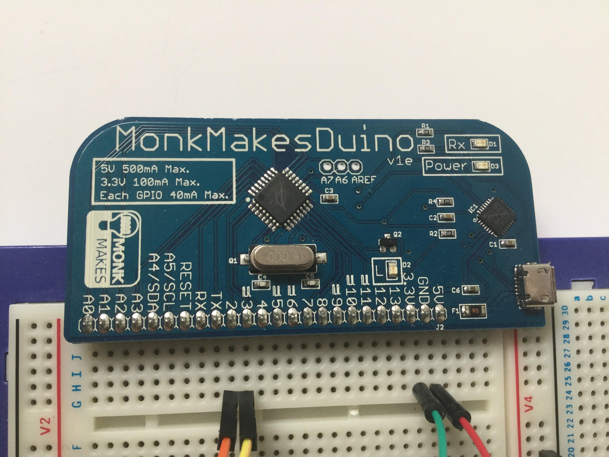

And a similar idea - DevDuino - which also includes built-in buttons, a buzzer, an LCD display and a voltmeter:

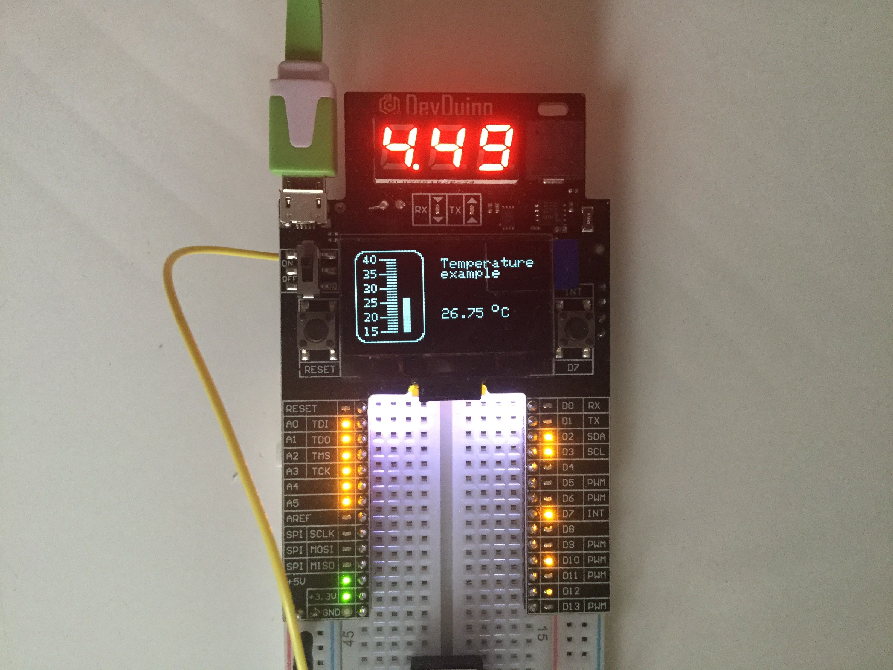

One clever design - STEMTERA - actually builds the Arduino-clone into the breadboard itself (and is compatible with Lego)

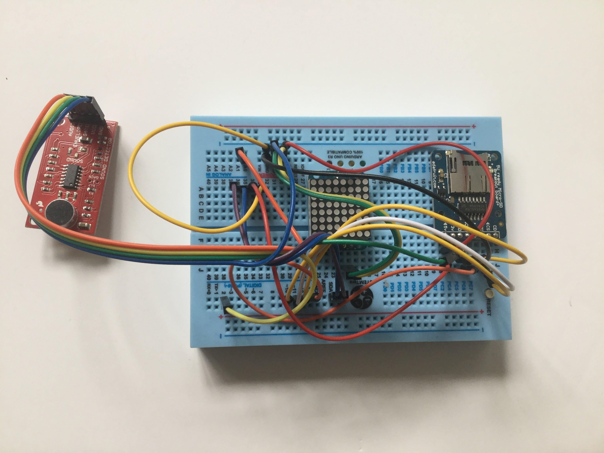

Other funky and cool designs have also been produced like this one from Boldport, "The Cuttle":

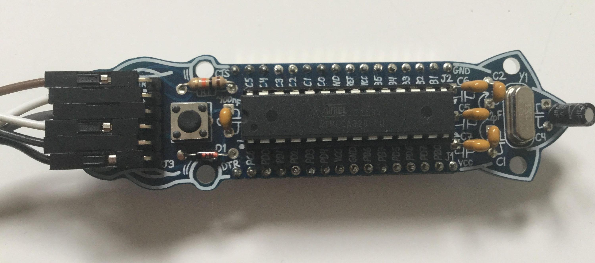

Other creative uses for Arduino in embedded projects include using one to produce a high-tech festival badge like this one from EMF Camp 2014.

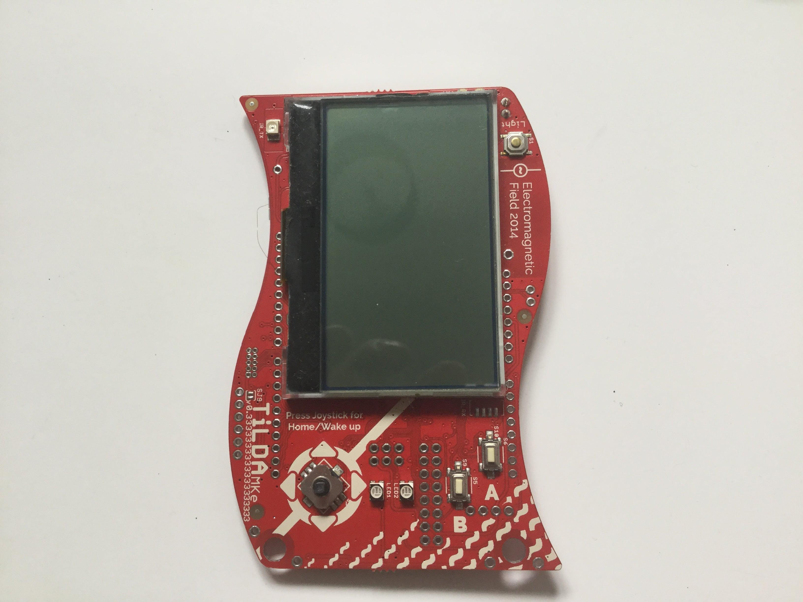

And don't forget, because the Arduino design is open hardware, you can even build your own on a breadboard:

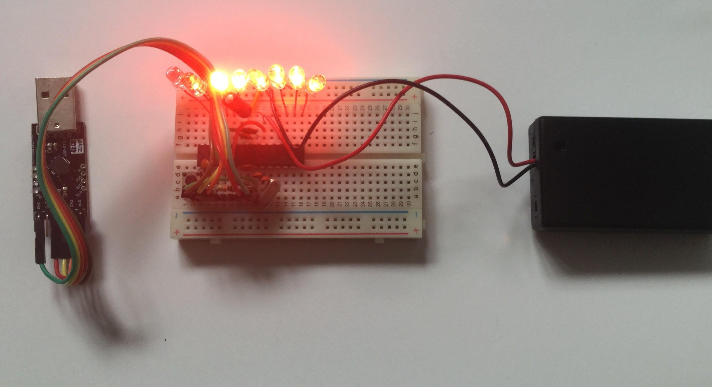
