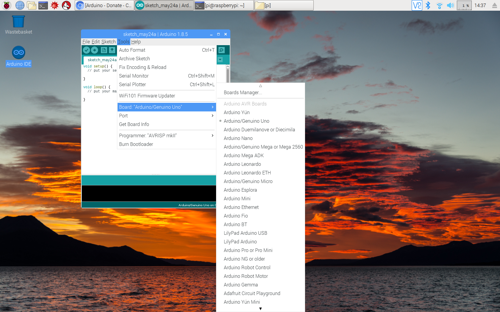
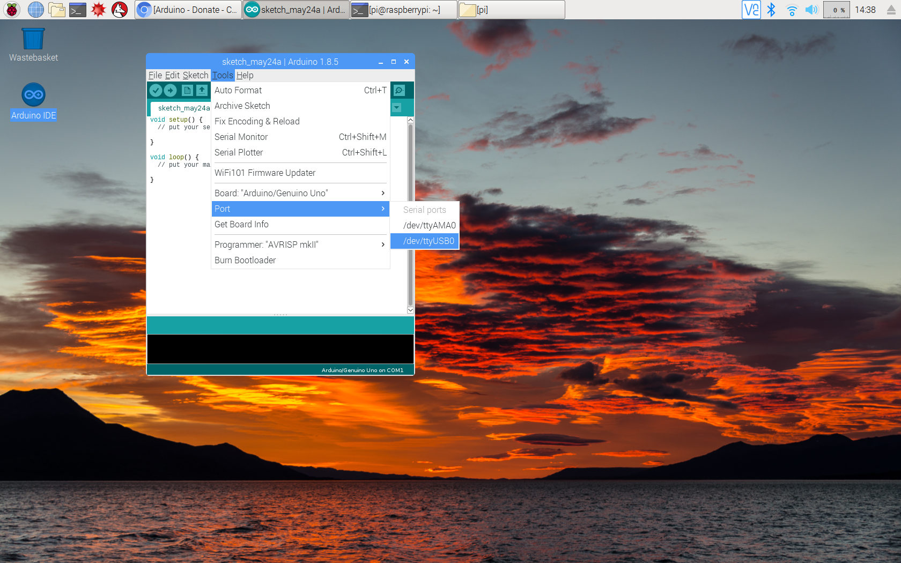
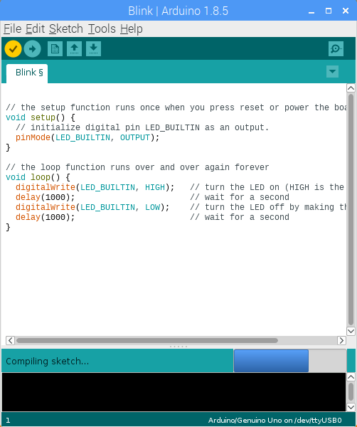
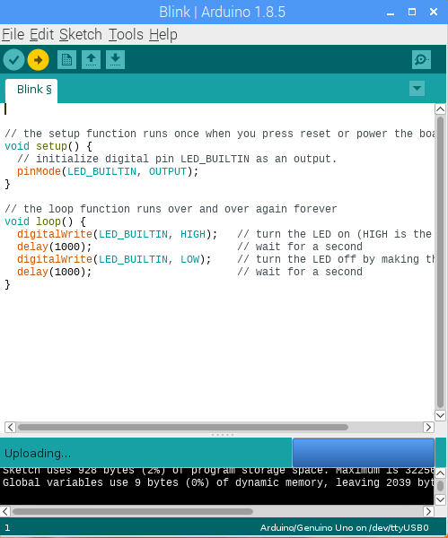

## The Arduino IDE

Most Arduino boards use serial communications interfaces, including Universal Serial Bus (USB) on some models. The USB is also used for uploading Arduino programs written on computers. The micro-controllers are normally programmed using a subset of features from the programming languages C and C++. To make this easy, the Arduino project provides an integrated development environment (IDE) which can be used to both edit code and handle the upload process. Versions of the Arduino IDE are available for Windows, Mac, Linux (including the Raspberry Pi).

To setup the IDE, you need to tell it which type of Arduino you're using and how it is connected to your computer. To set the type of Arduino, click on Tools then select Board and choose your device from the list. If you're using an Arduino compatible board made by another manufacturer (e.g. an Arduino Feather) then you will need to download additional board drivers. Check the manufacturers documentation for how to do this.

Next you need to slect the port that your Arduino is connected to. Click on Tools and then Port. What to select here will opened on what computer you're using. If it's a Raspberry Pi or another Linux machine, then it will probably be something like /dev/ttyUSB0. For a Mac, look for something like /dev/usbmodemFD141 (and it may have the board type in brackets). On a Windows machine it will usually be COM3 or something similar.

The IDE is simple to use. Type your code in the big white area - normally when you open the program for the first time or start a new program, the template code will be filled in for you.

Once you've added some of your own code, click on the tick in the circle on the top left of the IDE. This will compile your program. Some other text-based languages, like Python, are interpreted languages. This means that your code is run directly by your computer. The type of C used by Arduino is a compiled language and so the source code that you write must be compiled first to create an executable file.

This file is then needs to be uploaded to the Arduino where it will be run. You can do this using the IDE by clicking on the right-arrow button.

