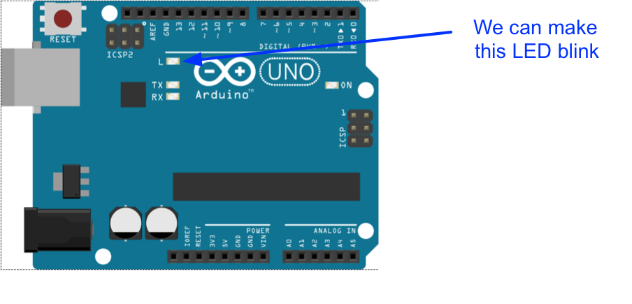
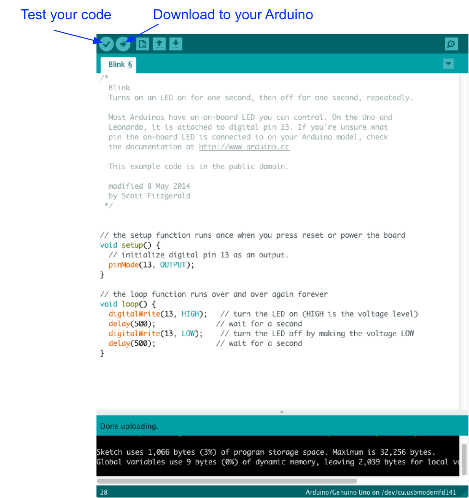

## The "Hello World" first Arduino sketch

An Arduino is a really useful microcontroller. The one shown below is an Uno, but you can use most other models with the same code and circuit (althought you may need to search up the pinout to work out which pins to use).

The Arduino is connected to your computer via USB. You create programs - called sketches - using the Arduino IDE and download them to the device using this cable.

To successfully connect you need to select the correct Board and Port from the Tools menu.

Try the sketch below to make the built-in LED on the arduino Uno blink.

Any line starting with // is a comment.

### Arduino Sketches
Every sketch must have a 'setup()' and 'loop()' block, enclosed by {}. The setup() block runs only once, when the sketch begins. You typically do “housekeeping” tasks in the setup() block to get things ready for the main part of the sketch. For example, you can set the modes of the input/output pins that you will need.

After the setup() block runs once, the sketch enters the loop() block. When we hit the } at the bottom of the loop() block, the sketch returns to the top and runs the lines over again. This continues as long as the Arduino is powered up.

Can you change the code to make the LED blink faster?
