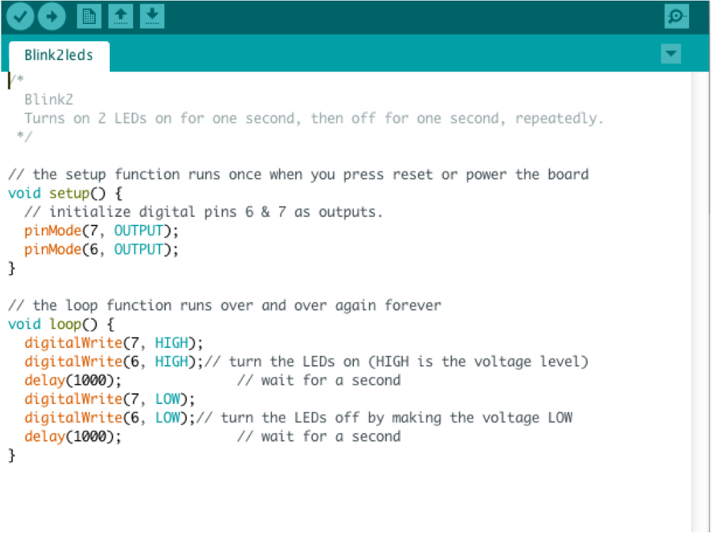

## Two LEDs on a breadboard

An electronics breadboard (as opposed to the type on which sandwiches are made) is actually referring to a solderless breadboard. These are great units for making temporary circuits and prototyping, and they require absolutely no soldering.

The circuit below uses 2 resistors to limit the current flowing through the LEDs.

This sketch uses two digital pins on the Ardunio, set as outputs, to control the LEDs.

--- challenge ---
## Challenge

Remove one of the resistors and swap its LED for a buzzer.
--- /challenge ---
