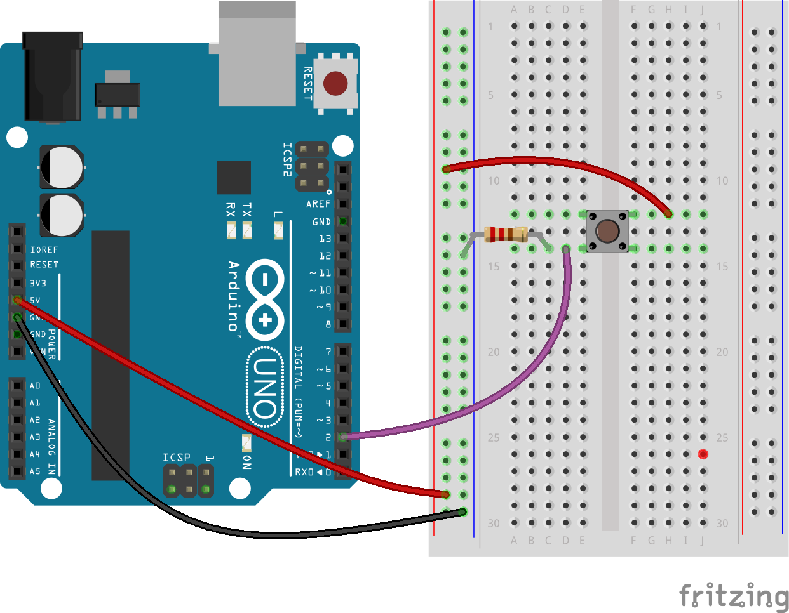
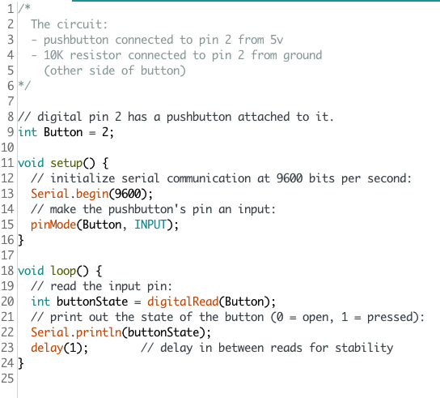
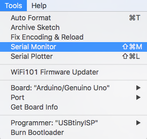
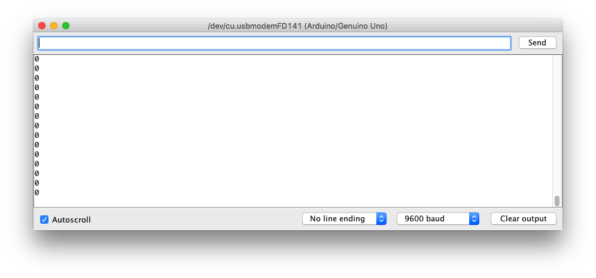
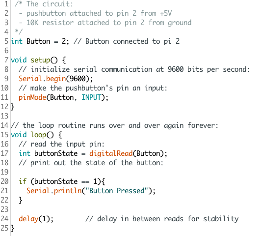

## Buttons and the Serial monitor

What about if you want to find out what the Arduino is doing? You can communicate with it using the Serial Monitor.

In this example, use an Digital pin as an input to detect when a button is pressed.

When the button is pressed the input value changes from 0 (LOW) to 1 (HIGH) and you can write this value to the Arduino's serial port.

To see these messages, run Tools -> Serial Monitor from the Arduino IDE.

Use an "if" conditional to adjust the message written to the Serial port so that it says something more helpful

--- challenge ---
Some very small Arduinos like the Trinket don't have a Serial port. Can you use an LED to indicate when the button is pressed?
--- /challenge ---
