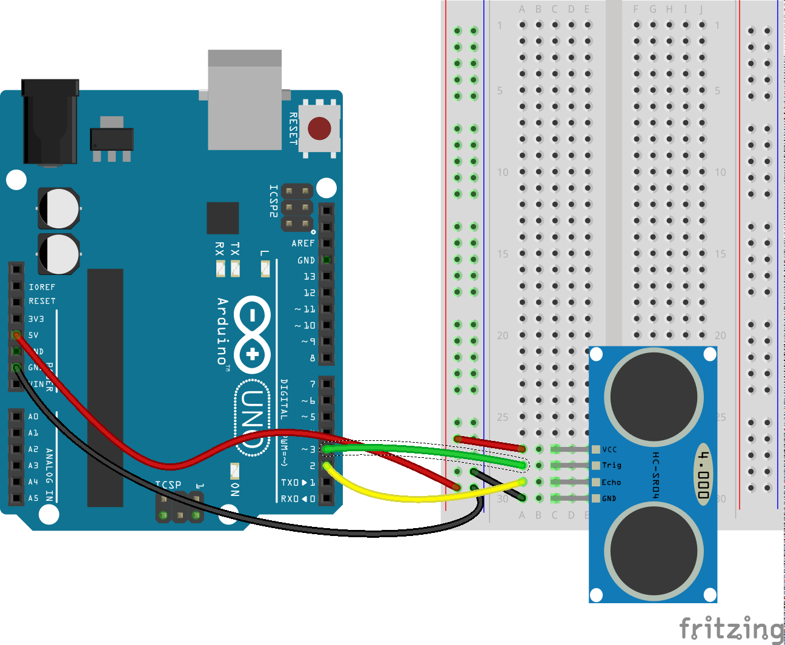
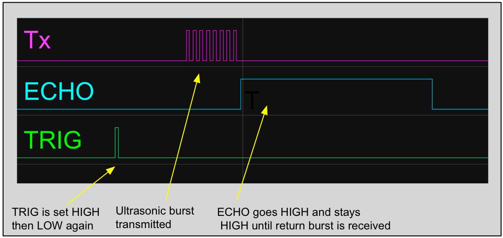
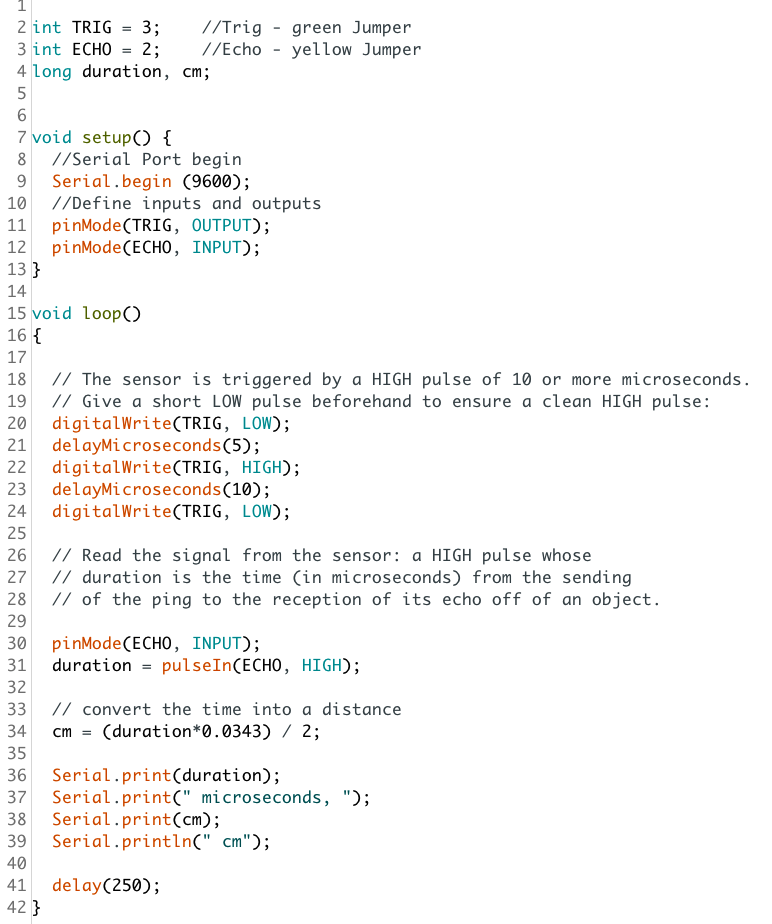
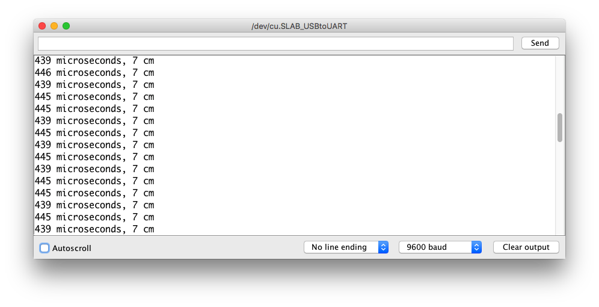

## Ultrasonic Range Finder

This circuit demonstrates how to use an HC-SR04 Ultrasonic Range finder to measure the distance to an object.

The HC-SR04 ultrasonic sensor uses sonar to determine distance to an object like bats or dolphins do. Power the module using Vcc, ground it using GND, and use an Arduino digital pin to send an input signal to TRIG, which triggers the sensor to transmit an ultrasonic burst of 8 x 40KHz pulses. The sound waves bounce off any nearby objects and some are reflected back to the sensor.

The ECHO pin will be “LOW” (0V) until the outgoing signal has stopped, at which point it goes HIGH (5v).  Once a return pulse has been detected, ECHO is set “LOW” again.  So the time for which the ECHO pin is HIGH equals the time taken for the sound wave to travel to the nearest obstacle and back.                                              

Your code needs to send a signal to the TRIG pin and then time how long the pulse on ECHO lasts. The Arduino language makes this easy thanks to the **pulseIn()** function which reads a pulse on a pin and returns the length of the pulse.

Because *speed = distance divided by time*, and you know how fast sound travels in air (343 m/s), you can calculate the distance to the obstacle.

Rearranging the formula you see that *distance = speed x time* which you can caclulate in your code (and remembering to convert to cm). You also need to divide your answer by 2 - can you explain why?

Use the Serial monitor to read the results from the sensor.

You now have all the circuits and code you need to build your own parking sensor. To be supre useful you could have both and audible and visual warning of a nearby object by including an LED and a buzzer.

Many sensors fitted to cars change the frequency of beep to indicate that you are moving closer (or further away) from the obstacle.

Sometimes you'll want to be able to mute the alert so use a button to silence the buzzer for a few seconds.
